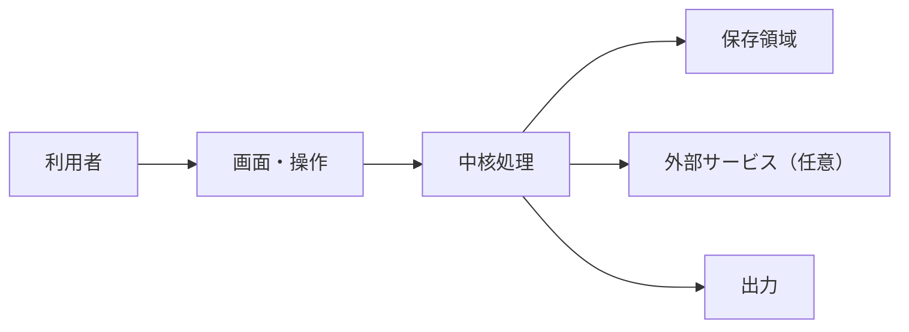

# ARCHITECTURE

現在採用している構造の正本です。候補を積み上げる文書ではありません。未決定は「未決定」と書き、判断待ちはSTATUSへ置きます。

## 全体像

【実際の構造へ書き換える。存在しない部品は消す】

## 構成要素

| 要素 | 責任 | 入力 | 出力 | 依存先 |
|---|---|---|---|---|
| 【】 | 【】 | 【】 | 【】 | 【】 |

## データの流れ

1. 【】
2. 【】
3. 【】

## 保存と正本

| データ | 正本 | Git管理 | バックアップ | 復旧方法 |
|---|---|---|---|---|
| ソースコード | Gitリポジトリ | する | リモート | clone |
| 【設定】 | 【】 | 【する／しない】 | 【】 | 【】 |
| 【利用者データ】 | 【】 | しない | 【】 | 【】 |
| 【生成物】 | 【】 | 原則しない | 【】 | 【】 |

## 外部依存

| 名称 | 用途 | 必須か | 認証 | 停止時の動作 | 利用規約・費用 |
|---|---|---|---|---|---|
| 【】 | 【】 | 【】 | 【秘密値は書かない】 | 【】 | 【】 |

## 信頼境界

- 利用者端末: 【】
- サーバー: 【】
- 外部サービス: 【】
- 公開ネットワーク: 【】
- 秘密情報を保持する場所: 【場所の種類だけ。値や個人の絶対パスは書かない】

## 失敗と復旧

| 失敗 | 利用者への表示 | 自動復旧 | 手動復旧 | データへの影響 |
|---|---|---|---|---|
| 【】 | 【】 | 【】 | 【】 | 【】 |

## 互換性

- 読み込む過去データ: 【】
- 書き出す形式と版: 【】
- 変更時の移行方法: 【】

## 採用した重要な判断

現在有効な判断だけを短く書きます。決定理由と過去案はWORKLOGとGit履歴へ置きます。

- 【】
